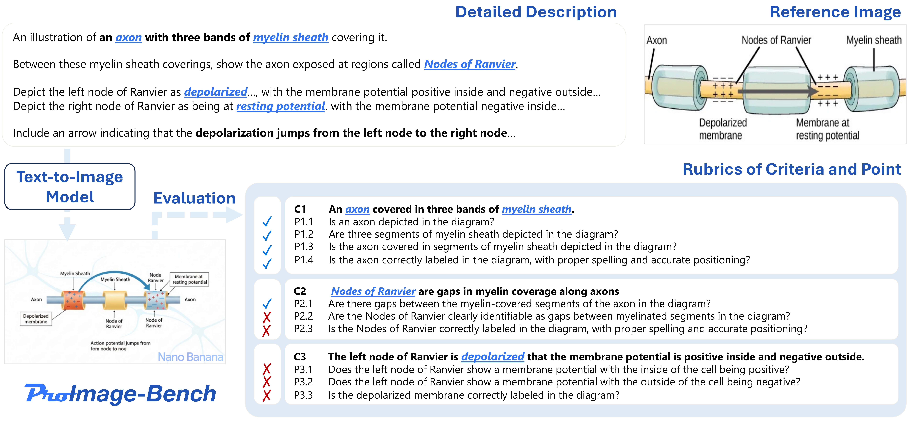

# ProImage-Bench: Rubric-Based Evaluation for Professional Image Generation

<div align="center">

[](https://arxiv.org/abs/2512.12220) [](https://kodenii.github.io/ProImage-Bench-web/) [](https://choosealicense.com/licenses/mit/)

</div>



## 📖 TL;DR

We propose **ProImage-Bench**, a rubric-based evaluation benchmark for professional image generation. The initial benchmark comprises **654 figures**, **6,076 criteria**, and **44,131 binary checks**. 

## 🌟 Contributions

Our contributions are threefold:

**🎯 Problem Formalization & Rubric Evaluation**  

We formalize the professional image generation problem and propose a rubric-based evaluation that decomposes verification into task-specific and domain-specific checks.

**📊 ProImage-Bench Release**  

We collect and release ProImage-Bench, spanning 654 tasks / 6,076 criteria / 44,131 binary checks across biology, engineering, and general domains in inintial version, with an automated LMM Evaluator and principled scoring.

**🚀 Comprehensive Analysis & Refinement**  

We provide comprehensive analyses showing (i) misalignment between open-domain prowess and professional accuracy, and (ii) significant gains from rubric-guided refinement, charting a path that produces specification-faithful and professional-grade images.


## 📊 Dataset Domains

Our dataset is divided into three domains. **For specific examples of each domain, please [visit our website](https://your-website-url.com).**

| Domain | Description |
| :--- | :--- |
| **Biology** | Sourced from biology textbooks; covers cellular structures, organelle functions, and metabolic processes.|
| **Engineering** | Derived from patent drawings; depicts architectural diagrams and mechanical structures.  |
| **General** | Includes schematic diagrams, physics illustrations, charts, and poster layouts. |

## 🏆 Leaderboard

Overall results on ProImage-Bench:

| Model                  | Bio (Acc) | Bio (Score) | Eng (Acc) | Eng (Score) | Gen (Acc) | Gen (Score) | **Overall (Acc)** | **Overall (Score)** |
|:-----------------------| :---: | :---: | :---: | :---: | :---: | :---: | :---: | :---: |
| **Nano Banana Pro** 🥇 | **0.849** | **0.625** | **0.708** | **0.434** | **0.816** | **0.601** | **0.791** | **0.553** |
| **Wan2.5**             | 0.714 | 0.433 | 0.606 | 0.309 | 0.755 | 0.519 | 0.692 | 0.420 |
| **GPT-4o**             | 0.704 | 0.425 | 0.556 | 0.258 | 0.718 | 0.463 | 0.660 | 0.382 |
| **Nano Banana**        | 0.697 | 0.400 | 0.579 | 0.276 | 0.716 | 0.468 | 0.664 | 0.381 |
| **Seedream**           | 0.680 | 0.393 | 0.560 | 0.260 | 0.688 | 0.442 | 0.642 | 0.365 |
| **FLUX**               | 0.592 | 0.286 | 0.444 | 0.167 | 0.616 | 0.359 | 0.551 | 0.270 |
| **Imagen-3**           | 0.600 | 0.288 | 0.492 | 0.195 | 0.638 | 0.377 | 0.577 | 0.287 |


---

## 📂 Project Structure

```
Project-Root/
├── API/                                 
│   ├── chat.py                           # GPT API interface
│   └── utils.py                          # API utility functions
├── ProImageBench/                        # Dataset (Download and extract here)
│   └── ProImageBench.json                
├── results/                              # Evaluation results 
├── images/                               # Images for README
├── calc_metrics.py                       # Calculating metrics
├── eval.py                               # Main evaluation script
├── judger.py                             # Evaluation logic 
├── requirements.txt                      # Dependencies
└── README.md                             # Documentation
```

---

## 🛠️ Prerequisites & Installation

### 1. Clone the repository
```bash
git clone https://github.com/kodenii/ProImage-Bench.git
cd ProImage-Bench
```

### 2. Install Dependencies
```bash
pip install -r requirements.txt
```

### 3. API Configuration
To use the generation or evaluation pipelines, you need to configure your API keys.
Open `API/chat.py` (and other model files in `API/`) to set up your endpoints.


### 4. Download Dataset
Download the **ProImage-Bench** dataset and unzip it into the project root.
[**Download ProImage-Bench Dataset**](https://drive.google.com/file/d/16TdFOyMRrFffd_L2hXQO7v-PP07Wo5P5/view?usp=sharing)

Ensure the directory structure is as follows:
```text
Project-Root/
└── ProImageBench/
    └── ProImageBench.json
```

## 🚀 Evalute your model on ProImage-bench

The evaluation process uses a **LMM Judge** (default: `o4-mini` or similar capable model configured in `API/chat.py`) to score generated images against the rubrics.

### Preparation

1.  **Download Dataset**
    Download the **ProImage-Bench** dataset and unzip it into the project root directory.

2.  **Model Inference & Image Generation**
    Before running the evaluation script, you need to generate images using your model based on the benchmark requirements. Load the `ProImageBench.json` file, iterate through each `task_item`, and perform the following steps:
    *   **Get Input**: Extract the text from the `detailed_description` field and use it as the input prompt for your model.
    *   **Generate Image**: Call your model to generate the corresponding image.
    *   **Save Image**: Save the generated image to the path specified in the `image_path` field.
### Running the Evaluation

Use `eval.py` to run the benchmark. You must specify the **domain**.

**1. Biology Domain:**
```bash
python eval.py bio
```

**2. Engineering Domain (with 8 workers):**
```bash
python eval.py engineering --max-workers 8
```

**3. General Domain:**
```bash
python eval.py general
```


***

### 📊 Outputs & Metric Calculation

Evaluation results are automatically saved in the `results/` directory:
*   **`results.json`**: Scores based on both contextual (task-specific) and general visual quality rubrics.

To compute and summarize the final metrics, use the commands below:

**Calculate metrics for the Biology domain:**
```bash
python calc_metrics.py bio
```

**Calculate metrics for the Engineering domain:**
```bash
python calc_metrics.py engineering
```

**Calculate metrics for the General domain:**
```bash
python calc_metrics.py general
```

**Calculate metrics for all domains :**
```bash
python calc_metrics.py all
```


## ✏️ Citation

If you find **ProImage-Bench** useful in your research, please consider citing our paper:

```bibtex
@article{ni2025proimage,
  title={ProImage-Bench: Rubric-Based Evaluation for Professional Image Generation},
  author={Ni, Minheng and Yang, Zhengyuan and Zhang, Yaowen and Li, Linjie and Lin, Chung-Ching and Lin, Kevin and Wang, Zhendong and Wang, Xiaofei and Liu, Shujie and Zhang, Lei and others},
  journal={arXiv preprint arXiv:2512.12220},
  year={2025}
}
```

## 📄 License

This project is licensed under the MIT License.